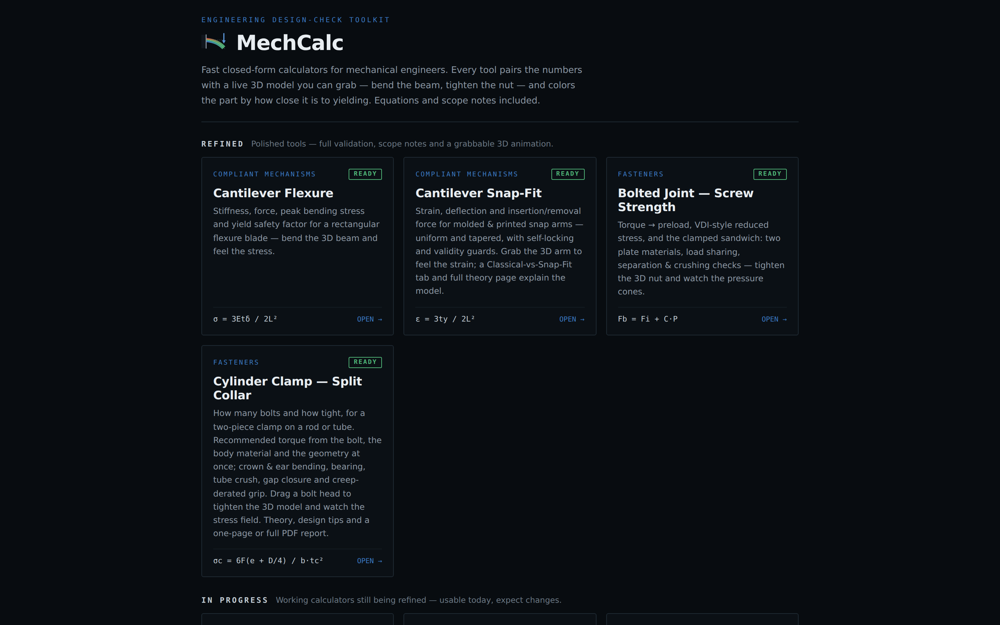
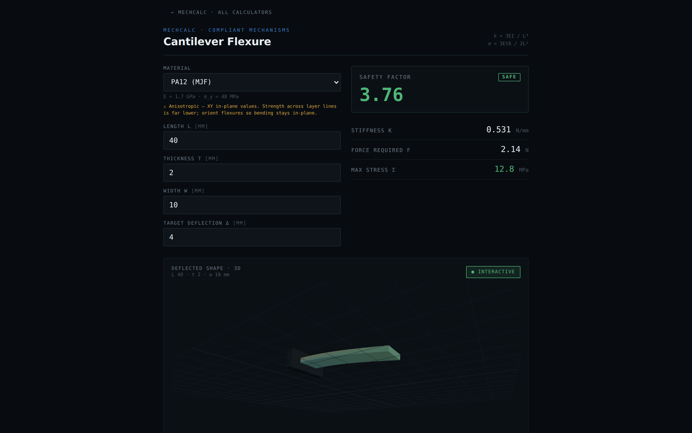
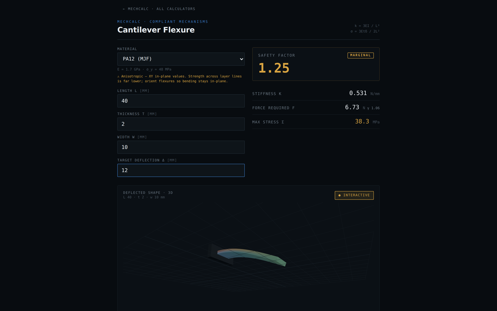
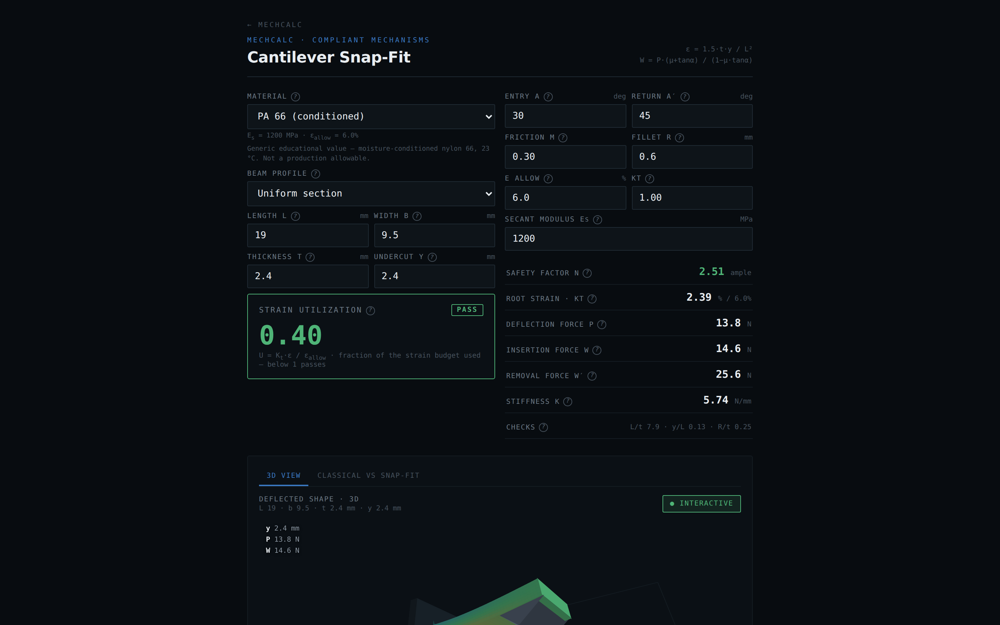
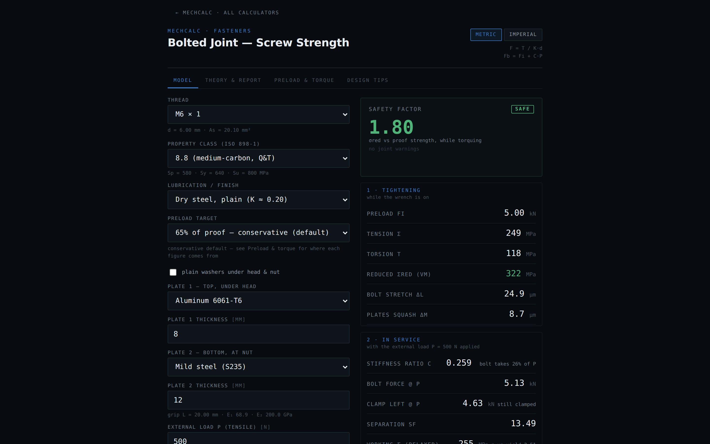
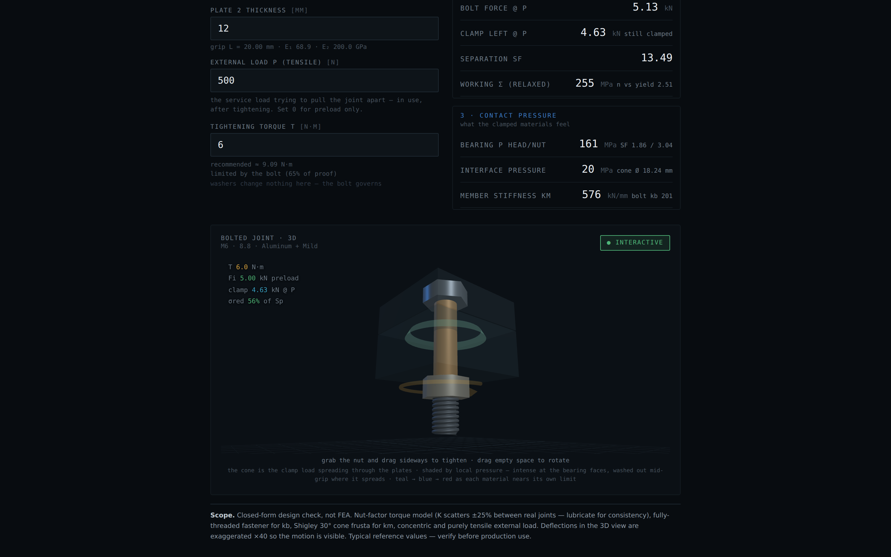

# MechCalc — Final Project Report (DRAFT)

**Course:** Uses and Development with AI, Led by an Expert — 0360714, Winter 2026
**Submitted by:** [YOUR NAME] and [PARTNER NAME] *(submission is in pairs — both names required)*
**Product:** MechCalc — <https://dmitrygofman.github.io/mechalc/>
**Repository:** <https://github.com/DmitryGofman/mechalc>

> **Draft notes — delete before submitting.** Everything in [brackets] is yours to
> fill. The screenshots and both sample PDFs referenced here are real captures from
> the running app, generated for this report; they live in `docs/report-assets/`.
> Add your own photos of the printed parts where marked. Target ≤ 4 pages.

---

## 1. Introduction to the Profession

I am a mechanical design engineer. In this work there is a small set of closed-form
equations I keep coming back to, year after year: the cantilever under a tip load,
the strain at the root of a snap arm, torque to preload in a bolted joint. They are
the daily design checks — quick calculations that decide whether a part survives
before anyone commits to detailed analysis or manufacturing.

Where I work, in a military organization, all design calculation is done on a
standalone, air-gapped network. The checks live in Excel sheets and MathCAD files
I can return to — but every project needs its adjustments, the files fork and
drift, and often it is faster to just redo the equation on paper. Beyond the
repetition there is a deeper problem: a spreadsheet gives a number with no
physical feel. It will not tell a junior engineer *how close* the part is to
failing, where, or what it would feel like in the hand.

**Required achievement.** A toolkit of design-check calculators that replaces the
Excel/paper round-trip for my recurring equations, and adds what a spreadsheet
cannot: an interactive 3D model that gives a real feel for the flexibility and the
material — including sound and touch — plus a printable calculation report in the
user's own numbers, so the check can be filed like any engineering document. The
toolkit contains only textbook equations and public reference data, so it can live
on the open web and grow tool by tool.

## 2. The Final Product

MechCalc is live at **<https://dmitrygofman.github.io/mechalc/>** (also attached
as a single self-contained `index.html` that runs offline — relevant where I
work). It is a growing catalog; this report focuses on the three calculators
that tell the story: the simple cantilever beam it started from, the snap-fit
that grew out of it, and the bolt torque calculator.

### 2.1 The cantilever beam — where it started

The first calculator was a simulation of a simple cantilever beam with a
rectangular cross-section, modeled with linear (Euler–Bernoulli) tip-displacement
theory: enter material, length, thickness, width and target deflection, and get
stiffness, the force required and the peak bending stress against yield. It was
made to check that a design works and doesn't fail — but just as much to give a
*feel* for the flexibility and the mechanical properties of the material and the
beam. The 3D beam bends as you drag its tip; the colors show extension and
compression of the different parts of the beam from the actual stress field; as
the beam approaches failure a rising tone plays, so you can hear when it is about
to snap, and on a phone the app vibrates in your hand.

That feel turned out to be the useful part. The tool was picked up by junior
engineers designing 3D-printed compliant beams — the material library carries
printed polymers with honest anisotropy warnings — and it was used to validate
designs and estimate forces before printing.

*The same PA12 blade at 4 mm and at 12 mm of target deflection: the safety factor
drops from 3.76 (SAFE) to 1.25 (MARGINAL), the force readout picks up the
uncertainty factor, and the beam's colors shift toward the root where the stress
concentrates.*

[PHOTOS: add 1–2 photos of real 3D-printed parts designed with this calculator.]

### 2.2 The snap-fit — a real design, not just a beam

After the simple version proved itself, a second version was designed around a
real cantilever snap-fit with the engaging tooth: entry and return angles,
friction, fillet radius at the root, uniform or tapered profiles. It computes
root strain against the material's strain budget, deflection force, and the
insertion and removal forces from the wedge action of the tooth — with a
self-locking guard for return angles that can never release, and validity checks
on the beam proportions. There was a lot of debugging and iteration during this
design; the model is cross-checked internally (the closed forms against a numeric
integration of the same beam) and covered by a test suite of ~40 cases, and a
Classical-vs-Snap-Fit tab plus a full theory page explain where the model comes
from and where it stops.

### 2.3 The bolt torque calculator

The third focus tool answers the most repeated question of all: how hard to
tighten. Torque → preload through the nut-factor model, the VDI 2230-style
reduced stress while the wrench is on, and the full clamped sandwich: each plate
its own material and thickness, Shigley pressure-cone member stiffness, load
sharing under the external load, separation and bearing-crush checks. The
simulation is interactive: grab the nut and drag to tighten, and watch the torque
climb, the bolt stretch, the plates squash, and the pressure cone shade with the
load each material carries — a real interactive feel for what tightening does to
the joint.

The recommended torques were not taken from the equations alone: a research pass
compared the calculator's outputs against known published torque tables. The
model reproduces the familiar handbook figures for steel joints (≈9 N·m for a dry
M6 class 8.8) and, because the target preload also respects the *plates'* bearing
limits, it drops to the much lower values plastics suppliers publish for printed
and molded materials (≈1 N·m for M5 into PA12) — matching the separate tables
those suppliers issue.

### 2.4 Reports, not just readouts

While using the app, a calculation can be exported as a typeset report — a long
form and a one-page bench sheet — built from the very numbers entered in the
calculator: the 3D figure snapshotted onto paper white, the worked equations
step by step, design tips, scope notes and references. The two attached sample
PDFs (`shaft-report-full.pdf`, `shaft-report-onepage.pdf`) were generated from
the app for this report. The report mechanism shipped with the newer calculators
and is being rolled back across the older ones; every calculator already carries
its theory section and design tips on the page.

## 3. Use of AI in the Project

The app was built by co-coding with Claude Code, following the working method set
in the course. The basic design was planned first: I started in VS Code by
creating the architecture plan — pure math modules separated from the pages, one
shared 3D painter, a shared materials library — and only then started building.
I also ran a research pass on the basic equations engineers use, with the idea of
making calculator generation automatic; the research was useful but the
conclusion was the opposite — the best way is to build a calculator *instead of*
each calculation I would otherwise do on paper or in Excel, one at a time, as
real need appears. As I work I keep adding tools, and it genuinely makes life
easier.

**The prototype-first workflow.** Each calculator starts as standalone HTML
prototypes with distinct designs — several interaction concepts for the same
tool, cheap to build and cheap to throw away. Claude then asks me questions about
how the design should continue, I pick a direction, and we iterate; then I use
the tool myself and check the physics against the handbook numbers before it
ships. The snap-fit is the clearest example: its design study produced the
3D-arm concept that became the calculator, and its engine is the one covered by
the ~40-case test suite. The logo was also generated with AI, as a design study
of eight candidates previewed in real context (browser tab, home screen, header)
before one was chosen.

**Prompts and outcomes.** [PASTE 3–4 REAL PROMPTS from your session history with
what came back. Strong candidates: the prompt that produced a design study's
prototypes; a physics correction where you caught a non-physical result and
pinned it to a handbook anchor; the torque-table validation request; a prompt
asking Claude to drive the app in a browser and screenshot it, which caught a
rendering bug no test sees.]

**The skill: turning the process into an asset.** After several calculators, the
recurring instructions became a skill — `new-calculator` (attached). It encodes
the definition of done ("not a form with numbers": tested math + grabbable 3D +
worked report + honest scope notes), the exact file anatomy, working code for the
two mechanisms that kept going wrong (the print-document flow, snapshotting the
3D view onto paper white), and a verification checklist. It is institutional
memory: the print export that once rendered as a black slab, the decoration that
leaned the wrong way because of a sign convention, the mis-framed camera — each
mistake became a rule, so no future session repeats it. A second skill,
`preview`, publishes the working tree as a live clickable app at the end of every
change, so review happens by using the tool, not reading a diff.

**With/without comparison.** [RECOMMENDED — run it and paste results: give the
same prompt, e.g. "add a helical coil spring calculator", once on a branch with
the skill removed and once with it present, and show the two outcomes side by
side. Without the skill: a working form with math, and none of the rest. With
it: the full anatomy, wired into routes, catalog and README, verified in a
browser.]

**Working correctly, not blindly.** Two habits kept this co-coding rather than
vibe-coding: every physics result had to reproduce a named textbook anchor before
shipping (the torque tables, Shigley's Kts anchors, the snap-fit cross-checks),
and every session ended with driving the real app — dragging the handles,
printing the report, checking the phone width — because the bugs that matter
never fail a unit test. A small illustration: the assignment PDF itself contains
a hidden instruction planted for AIs that read it. It was caught and not
followed; reading the AI's output critically, including this report, is the whole
point.

## 4. Summary

The required achievement was met: the recurring equations now live as calculators
I reach for instead of Excel, MathCAD or paper — and the toolkit gives what those
never did: the feel of the part in your hands, and a filed-quality report at the
end. The tools are in real use, including by junior engineers who design printed
compliant beams with the cantilever tool, and the catalog keeps growing with the
work.

**In retrospect.** The skill should have been written after the *first*
calculator, not after several — every rule in it was first paid for the expensive
way. The early automatic-generation idea was the opposite lesson: I initially
aimed AI at the wrong kind of leverage (generating many calculators from a
table of equations) when the real multiplier was depth — one calculator at a
time, built to a standard a skill can enforce. And I underestimated what could be
asked: early prompts requested functions; later ones requested entire calculators
against the skill's definition of done, and quality held. Where dependence on AI
could have hurt the product — the physics — the anchor-validation habit contained
it: no non-physical result that we know of survived to deployment, and each page
states honestly where its model stops.

---

*Attachments per the submission list: (1) this report as PDF; (2) the screenshots
above and a short screen-capture video of dragging the 3D models
[+ your photos of printed parts]; (3) the product — live URL and standalone
`index.html`; (4) the `new-calculator` and `preview` skills; (5) the repository
with the code, including the two sample PDF reports generated by the app.*
